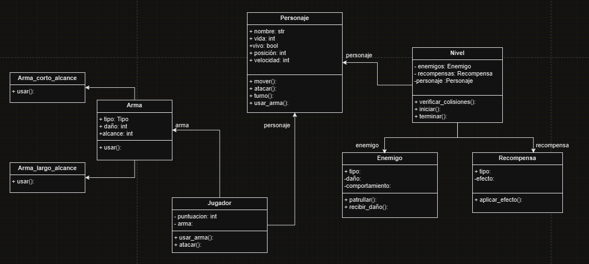

# Proyecto de Programación Orientada Objectos: Videojuego con sistema de combate.

Descricion del problema:El proyecto consiste en crear un videojuego de plataformas inspirado en Super Mario, pero con un sistema de combate directo en lugar de eliminar enemigos mediante saltos. El jugador podrá atacar a los enemigos usando armas o habilidades que puede obtener como recompensas.  

