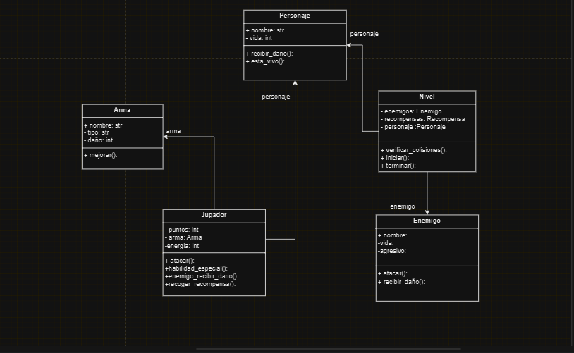

# Proyecto de Programación Orientada Objectos: Videojuego con sistema de combate.

## **Descripción del problema:**

El proyecto consiste en crear un videojuego inspirado en Super Mario, pero con un sistema de combate directo en lugar de eliminar enemigos mediante saltos. El jugador podrá atacar a los enemigos usando armas o habilidades que puede obtener como recompensas.  

# **Características principales:**
Movimientos básicos: El personaje podrá desplazarse hacia la izquierda, derecha, saltar y caer, controlado mediante teclas.  Sistema de recompensas: El jugador podrá recolectar monedas e ítems que aumenten su puntuación y le otorguen mejoras como armas o habilidades temporales. Sistema de combate:

-El jugador podrá atacar a los enemigos con armas de corto alcance (espadas, puños) o de largo alcance (proyectiles, magia).

-Las armas serán obtenidas como recompensas, con límites de uso o munición. Enemigos:

-Contarán con patrones de movimiento y ataque, haciéndolos impredecibles.

-Algunos enemigos serán más vulnerables a ciertos tipos de ataques.

# **Clases y estructura del juego:**
Para mantener una arquitectura flexible y escalable, el diseño del juego se basa en programación orientada a objetos, con clases organizadas para facilitar la expansión del código:

-Personaje: Clase base que define atributos esenciales como nombre y vida, además de métodos para recibir daño y estar vivo

-Jugador (hereda de Personaje): Contiene atributos como puntos, arma, energía y métodos como atacar, recibir daño, habilidad especial y finalmente recoger recompensa.

-Enemigo (hereda de Personaje): Define los comportamientos de atacar y recibir daño.

-Arma: Clase encargada de gestionar el nombre del arma(flecha, puño), tipo(corta o larga) y daño

